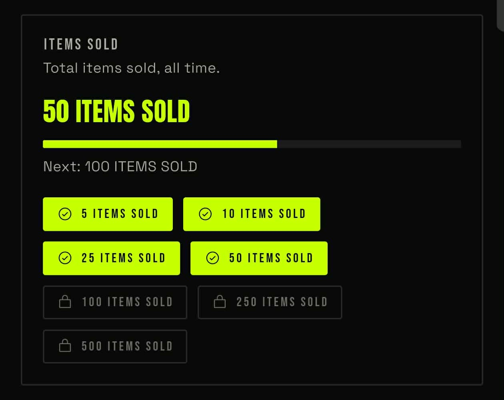
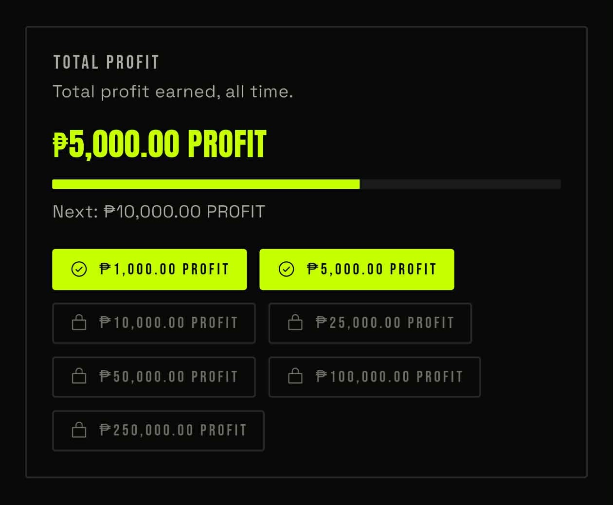
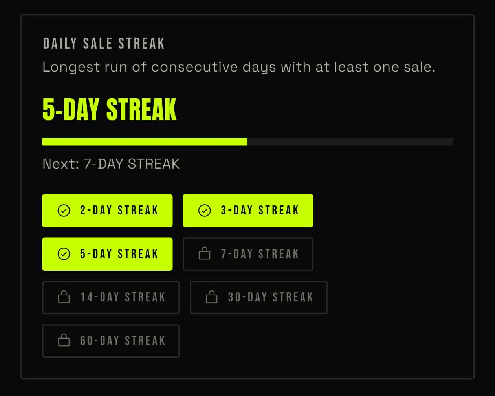
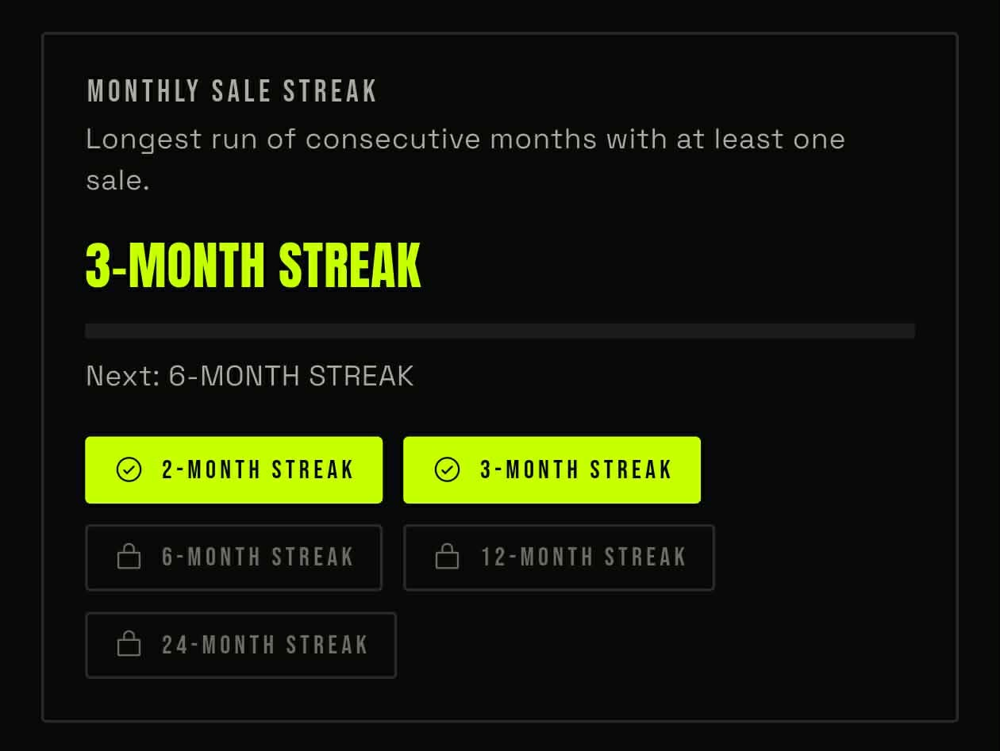

# Achievements
This is located on the analytics page, on the right side of the app bar — the **trophy icon**. Click it to be redirected to the achievements page. Here, you can see what you've achieved in the time since you started selling and tracking your items.

## Items Sold

It will tell you the level of items you've already sold and your next goal.

## Total Profit

This is pretty much self-explanatory, same deal as Items Sold.

## Daily Sale Streak

This shows your streak, like continuous days with sold items. If you hit a 30-day streak, well then good for your business.

## Monthly Sale Streak

Same-same but different from Daily Sale Streak — this is just the monthly version. So if you've missed a month, maybe that's a sign to reconsider the career path you chose. But hey, if you're going through something, just take your time and bounce hard.