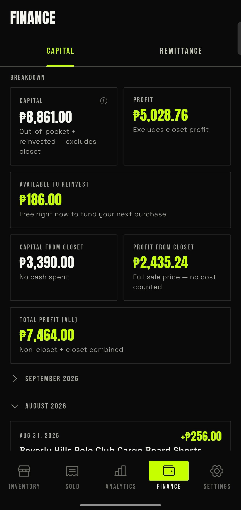
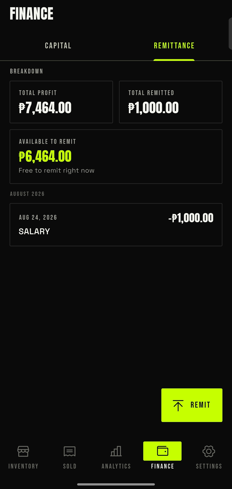

# Finance Overview
In this guide, just a quick overview on what to expect in the finance navigation item. This section is separated into two tabs.

## Capital Tab

Here's what you'll find in this tab:

- **Capital breakdown** — same breakdown you'll see in analytics, but focused on capital.
- **Capital timeline** — shows what you've purchased and what you've sold, basically the whole inbound and outbound timeline.

Check out the [Capital Tab Walkthrough](./02-capital-tab-walkthrough.md) to know more.

## Remittance

This isn't really in the scope of an inventory and sales tracking application, but the devs figured hell, why not. In this page, you can:

- Track your profit
- Remit
- Monitor your money

Check out the [Remittance Walkthrough](./03-remittance-walkthrough.md) to know more.