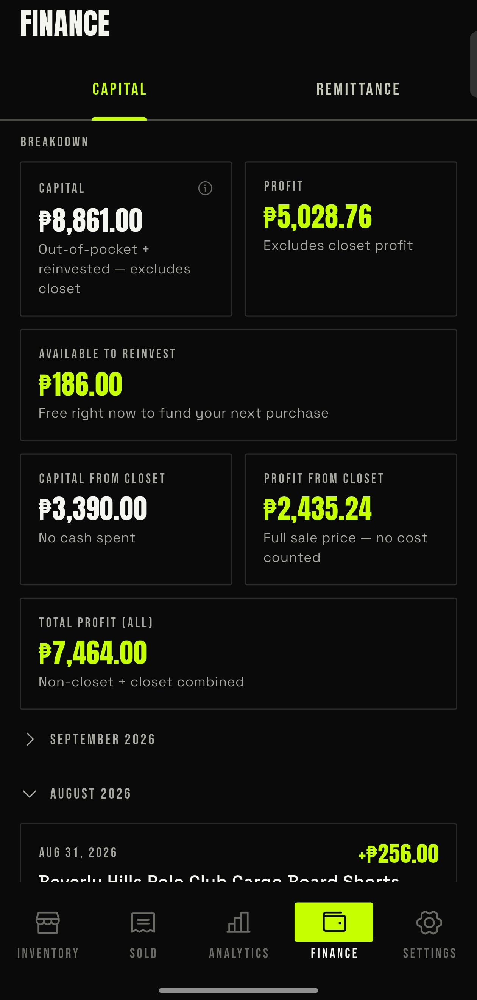
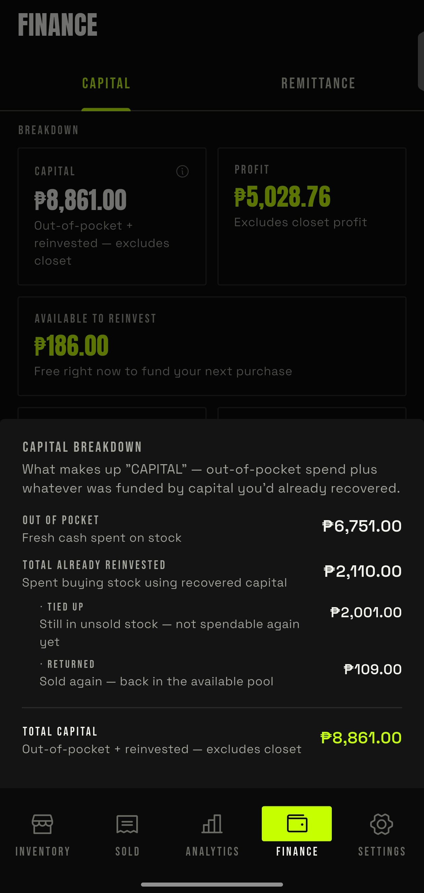
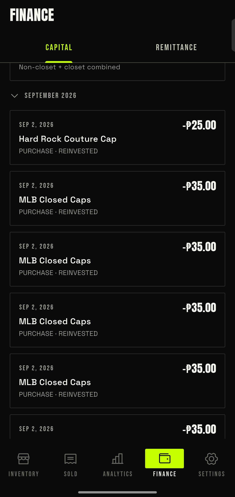

# Walkthrough
This is like in analytics, just focusing on the capital. The first section is kinda redundant, but it is what it is.

## Breakdown

Cards here are the same cards as in analytics, but just focus on the capital/profit sector:

- **Capital** — I already explained this, tho.
- **Profit** — doesn't include closet profit.
- **Available to reinvest**
- **Capital from closet**
- **Profit from closet**
- **Total profit**

Look, I'm tired of explaining this card. Just putting the [associated guide](../analytics/02-analytics-main-page-walkthrough.md#capital-breakdown) here. It's the damn devs' fault also putting this card that's already on analytics, but hey, as they say you cannot underestimate stupidity and lack of awareness. I think the dev just knows how their audience thinks, I guess.

## Timeline

This timeline is just a mix of sold and added items, like outbound and inbound, so you know the timeline of things you spent on and what you gained income from. Redundant stuff, but I'm not gonna complain.
