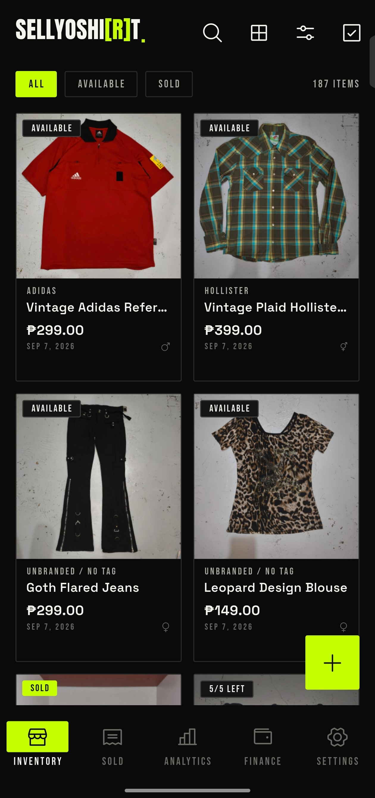
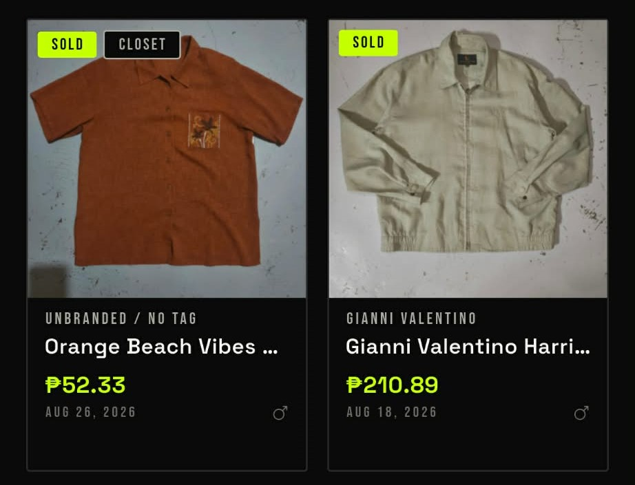
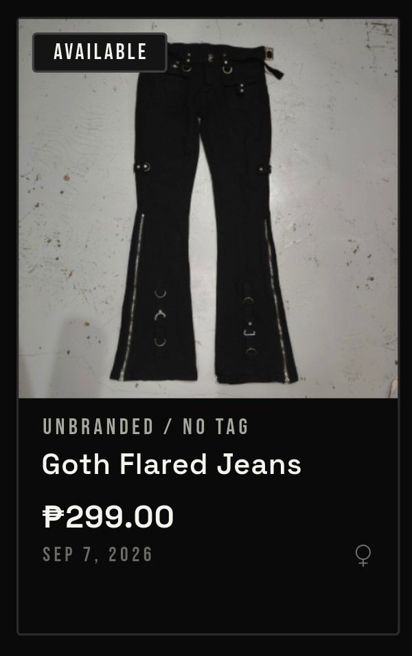
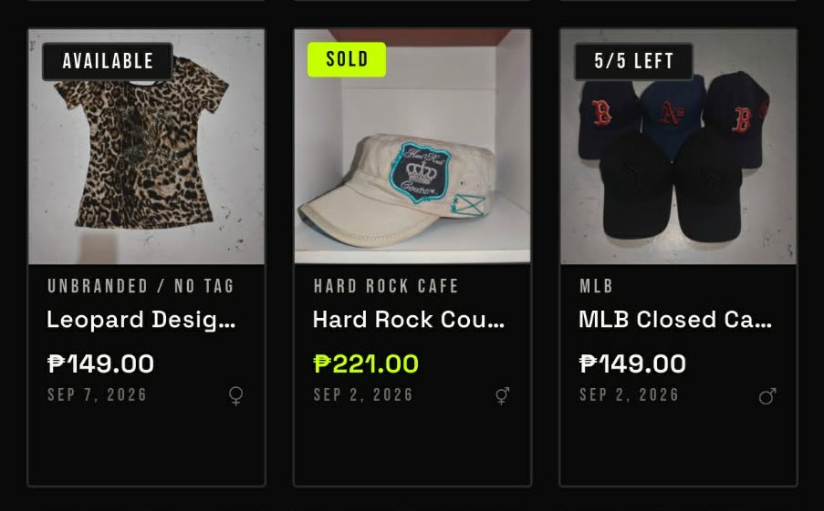
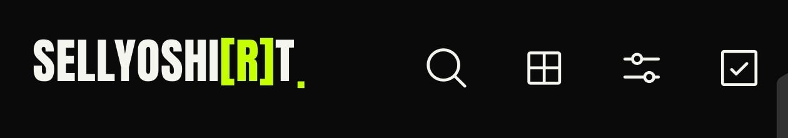
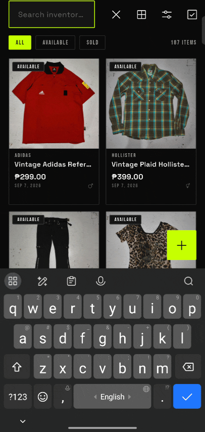
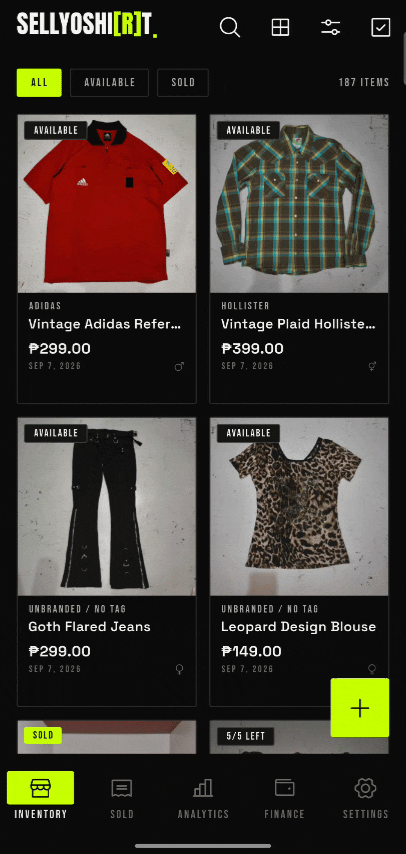
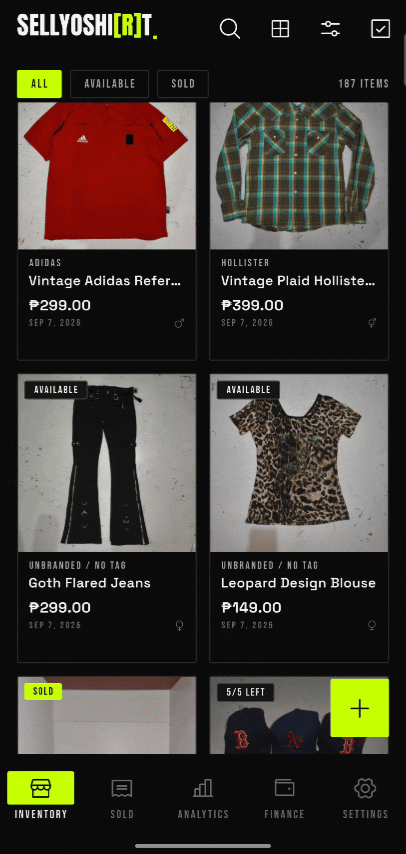

# Inventory Overview

Everything you're selling lives in one inventory list. This page covers
how an item card is put together and how closet items differ from
sourced ones.

## Closet vs. Sourced Items

Items can be tagged as coming **from your own closet** (stuff you
already owned) or as something you sourced specifically to resell.
That distinction isn't just for show — closet items skip cost-basis
tracking entirely in the analytics breakdown, since there was never a
purchase price to log for that hoodie you've owned since 2019.

## Item Card Anatomy

Every item in the list renders as a card with a thumbnail, name, price,
and a couple of at-a-glance indicators.

### Badges

Every item card can carry up to two badges:

- **Status badge** — shows whether the item is available or sold. If
  it has more than one unit in stock, this badge shows
  `(n sold) / (n left)` instead.
- **Closet badge** — shows up only if the item came from your closet.
  No badge means it's a sourced garment.

### Price

The highlighted number is the garment's asking price, shown in white.
Once the item sells, that same number turns neon yellow-green and
switches from the asking price to whatever it actually sold for.

### Other Details

- **Header** — the garment's title and brand.
- **Below the price** — the date it was added, or the sold date once
  it's gone.
- **Right side** — whether the garment is for men, women, or unisex.

## Action Buttons

There are 5 action buttons total on the inventory page: 4 in the app
bar and 1 floating.

### Add Button

The floating **+** button adds a new item to your inventory. Head to
[Adding an Item](./02-adding-items.md) for the full walkthrough.

### Search Button

The magnifying glass searches your inventory by keyword — because
scrolling through 300 tees to find one graphic print isn't a good use
of your time. See [Filtering and Searching](./05-filtering-and-searching.md)
for the details.

### View As Button

Controls how item cards are displayed — 2, 3, or 4 per row grid, or as
a list. Defaults to 2 per row.

### Filter Button

Opens a modal for filtering and sorting your inventory list. See
[Filtering and Searching](./05-filtering-and-searching.md) for the full
breakdown.

### Select Items Button

Lets you select multiple items and mark them all as sold at once. You
can still filter, search, and switch views while selecting, so you're
not stuck scrolling through an unsorted mess to find what you actually
sold. See [Selling Items](./04-selling-items.md) to learn how the
marking-as-sold flow works.

Haven't set up your store profile yet? Start at
[Onboarding Setup](../onboarding/01-onboarding-setup.md).
