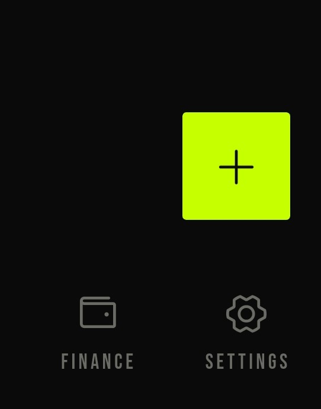
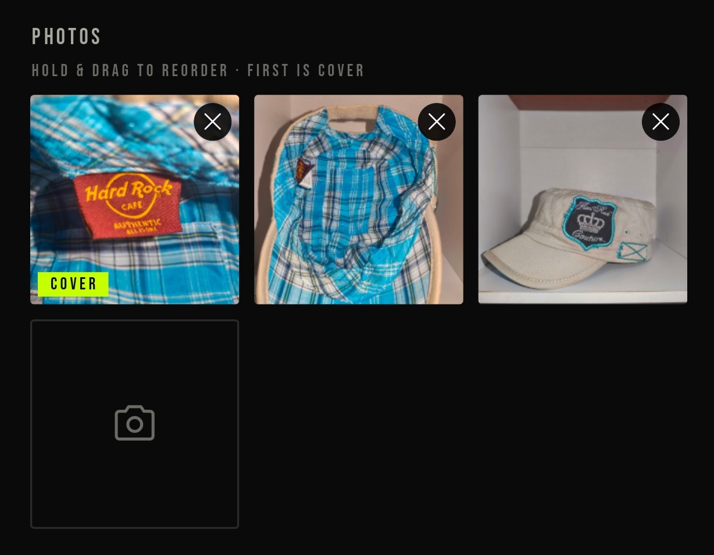
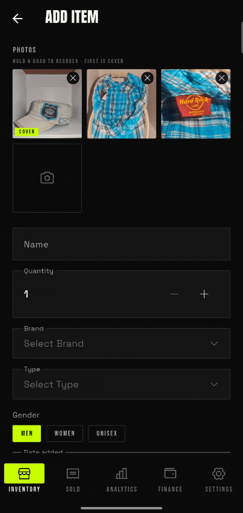
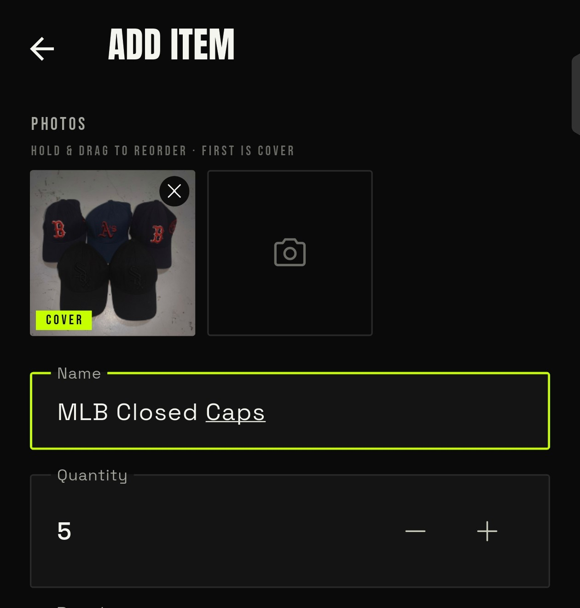
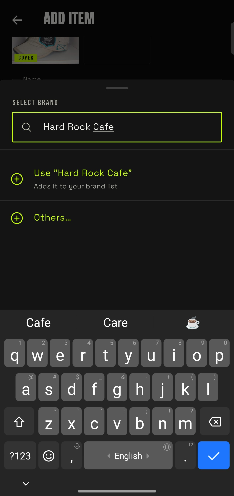
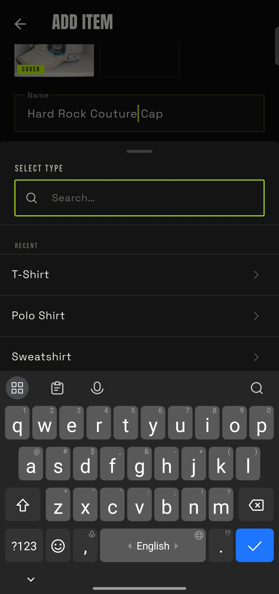
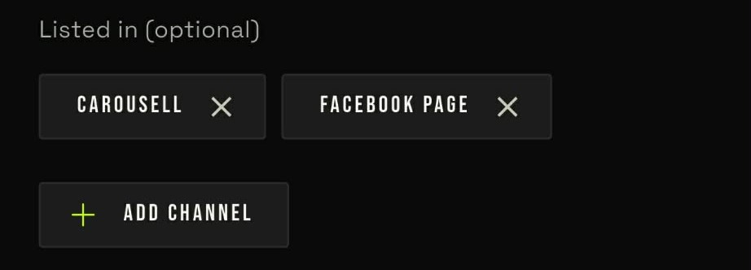
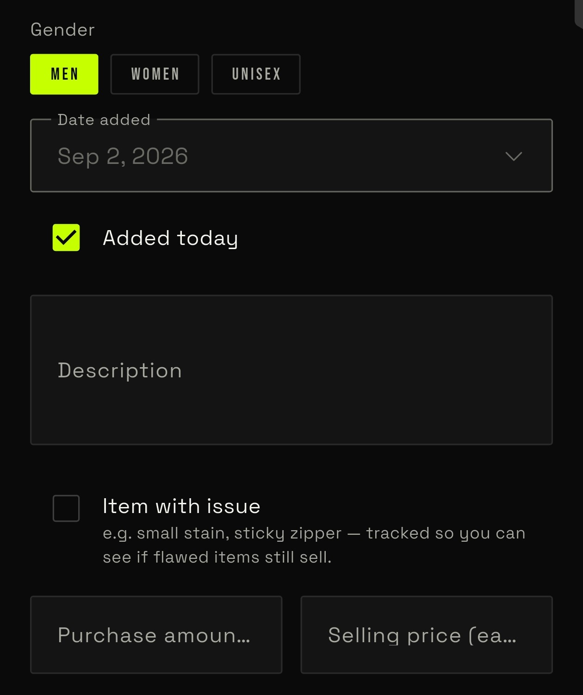
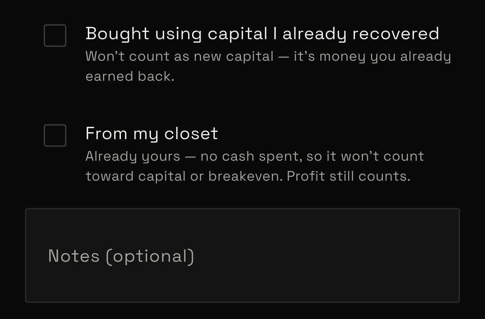

# Adding an Item

There's one way into the item form, whether you're adding your first
item or your five-hundredth: the **+** button on the inventory screen.

## Manual Entry

Fill in the fields below, attach at least one photo, and save — the
item appears at the top of your inventory immediately.

### Photos

1. Attach at least one photo — the first one you add becomes the card
   thumbnail.
2. Add more later from the item detail screen if you didn't get around
   to it now.
3. Long-press a photo to swap or reorder it.

### Main Fields

- **Name** — required (e.g. *Loose Fit Graphic Tee*).
- **Quantity** — bump this up if you're carrying more than one unit of
  the same item.

### Brand and Type

The system comes preloaded with common brands and types. The last 5
you've picked show up in a Recent section for quick access. If the
brand or type you need isn't listed, type it in anyway — it gets saved
and can be edited later from Settings.

### Listed In

This is where you pick what platform you listed this garment on. It's
preloaded with only Carousell and Facebook Page, but you can edit it in
Settings — see the
[Settings Walkthrough](../settings/01-settings-walkthrough.md) for how.

### Gender

Pick whether the garment is for women, men, or unisex.

### Date Added

Check **Added today** to log the garment under today's date, or
uncheck it and pick a different date added.

### Item with Issue

Got a flaw to disclose? Check this box and a field opens up so you can
add more details about the issue.

### Price

This is where you log what you paid for the garment and what you're
asking for it. It matters, because every purchase amount accrues to
your capital — except for closet items. Learn more in
[Closet vs. Sourced Items](./01-inventory-overview.md#closet-vs-sourced-items).

## Additional Fields

### Bought Using Capital

In every business, you're working with a fixed pool of capital — you
can't just buy everything out of pocket. Do that enough and you're not
growing a business, you're speedrunning bankruptcy. So if you've got
capital already recovered from past sales, toggle this on to roll it
back into a new purchase instead of dipping into your own wallet.

### From My Closet

If you checked the box to include closet items during onboarding, this
field shows up on the form. It just means the item is already
yours — you didn't source it to resell. This matters because closet
garments don't count toward capital. Profit still counts, though.

### Notes

Got something to say about the item that doesn't have a dedicated
field in the system? That's what notes are for.

## Submitting

That's what the "Add to Inventory" button is for. Once everything is filled in, tap it and the item gets added to your inventory.
