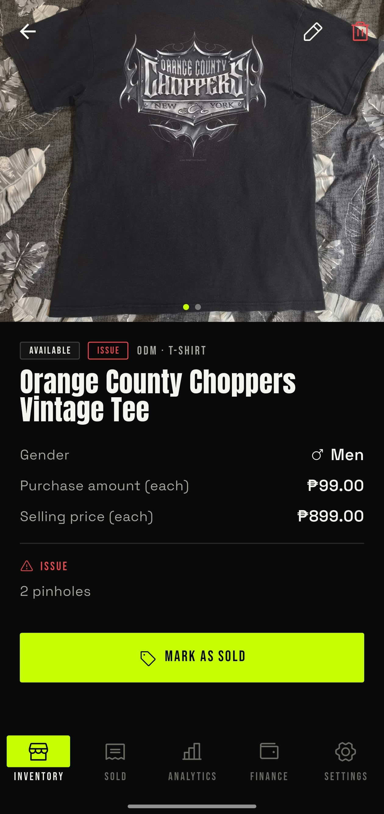
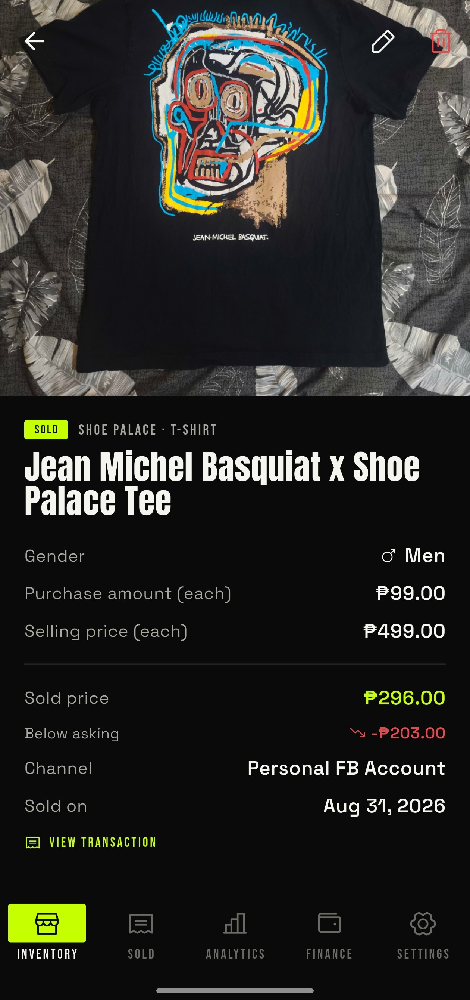
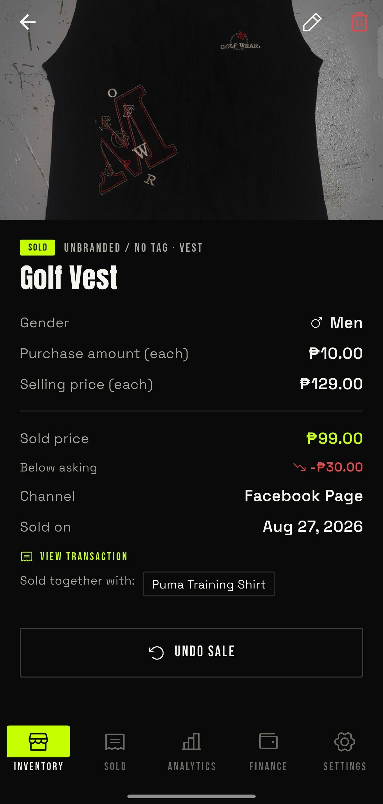
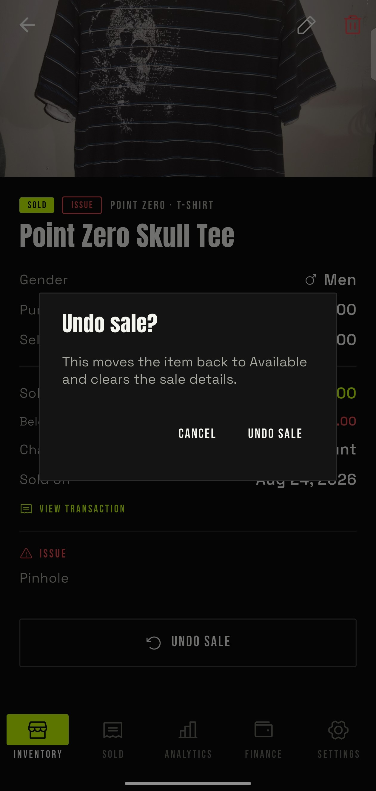
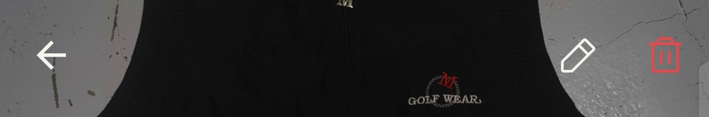
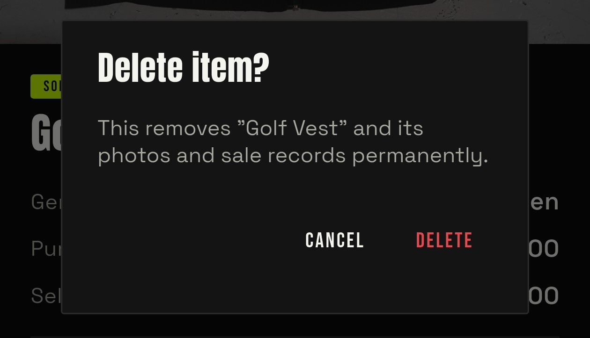

# Item Details

This guide covers what information you'll see on the details page, and
the actions you can take there.

## Available Item Anatomy

There's a difference between the details shown for an available item
and an already-sold one.

### Main Details

- **Badges** — same as the inventory card: status badge, plus a closet
  badge if it applies.
- **Brand and type** — sits on the same line as the badges.
- **Title** — the garment name.
- **Gender** — men's, women's, or unisex. We might get cancelled for
  this one. Take it easy on us, woke bastards.
- **Price** — purchase amount and selling price, both labeled "each"
  since an item can have more than one unit in stock.
- **Listed In** — which platform you listed this item on.
- **Issue/Notes** — whatever you flagged when adding the item shows up
  here.

Basically, everything you input shows up here. Kind of pointless to
fill in a field you can never see again, right? UI/UX 101.

### Mark As Sold Button

Click this when the item sells. Head to
[Selling Items](./04-selling-items.md) for the full walkthrough on how
that flow works.

## Sold Item Anatomy

There are additional fields and a button for a sold item.

### Added Information

This shows a few extra details:

- **Sold price** — compared against your asking price, and shown as
  "above asking" or "below asking" right underneath.
- **Channel and sold on** — where you sold it and when.
- A **View Transaction** link, for all the details tied to that sale.

### Bulk Sold vs. Single Sold Difference

Look, I'd suggest reading [Selling Items](./04-selling-items.md) first
if you haven't. And if you still don't get it after that... why the
farts are you reselling, you beautiful disaster of a human?

Just kidding. Sold price works a little differently when an item goes
out as part of a bulk sale — that's just our term for selling more
than one item in a single transaction. You'll also see a
**Sold together with** list, showing which other items rode along in
that same bulk sale.

### Undo Sale Button

Click here to undo a sale. We don't support editing a transaction
directly, so undoing it is the workaround.

Note: undoing a sale on an item that's part of a bulk sale doesn't undo
the whole transaction — it just detaches that one item from it. To undo
an entire transaction in one shot, see the **Action Button** section
on the [Sold Page Walkthrough](../sold/01-sold-walkthrough.md#action-button).

## Header Action Items

### Back Button

Look, this is pretty straightforward. I don't know why I'm still
explaining this to you. Back button means back button. Are you stupid,
or a functioning human?

### Edit Button

Click here to modify something — even a sold item stays editable. Not
sure if this is the right thing but as they say, "it's not a bug, it's a
feature."

### Delete Button

Click here to delete an item. You can still delete it even after it's
part of a transaction — deleting it just removes it from that
transaction. If you've got beef with how this app is structured,
message us about it. Don't shoot the messenger, I just typed this
stuff up.
