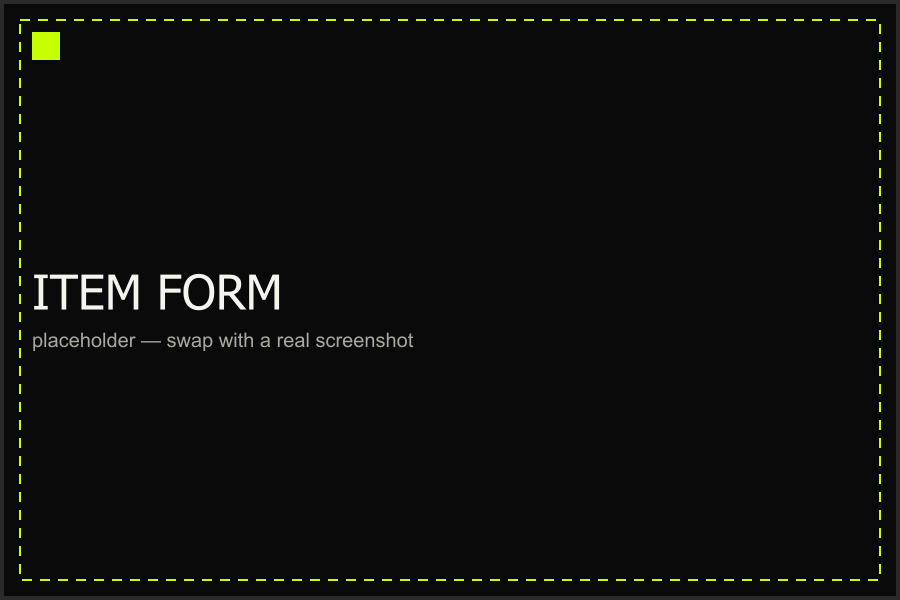

# Adding an Item

There's one way in to the item form, whether you're adding your first
item or your five-hundredth: the **+** button on the inventory screen.

## Manual Entry

Fill in the fields below, attach at least one photo, and save — the
item appears at the top of your inventory immediately.

### Photos

The first photo you add becomes the card thumbnail. You can attach more
from the item detail screen later.

### Price & Brand

Both plain text/number fields — brand isn't a fixed list, so typos
become their own brand the first time (fix them from Settings → Manage
Options).

Need your store profile set up first? See
[Onboarding Setup](../onboarding/01-onboarding-setup.md).

