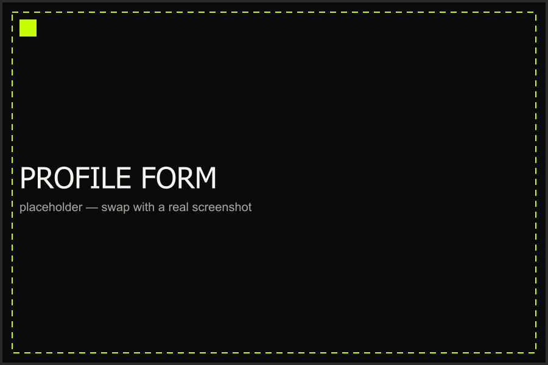

# Onboarding Setup

The first thing sellyoshit asks for on a fresh install is your store
profile. This page walks through the fields it needs and what happens
after you save.

## Needed Fields

The onboarding form only asks for a couple of things — everything else
can be filled in later from Settings.

### Name

Your own name, or whoever's running the shop day to day. Shows up on
receipts and in the backup file metadata.

### Store Name

The name of your closet/store as customers know it. This is what shows
up at the top of the app once onboarding is done.

### Track closet items

Checking track closet items checkbox allows you to sell stuff that you already own. By toggling this option, when you sold clothes that are from your closets, it is not included in the capital computation (All sold closet items belongs to profit)

## Saving Your Profile

Once both fields are filled in, tapping **Get Started** writes your profile
to the local database and takes you straight to your (empty) inventory.
There's no server round-trip — everything lives on-device.

Ready to put something in that empty inventory? See
[Adding an Item](../inventory/adding-items.md) next.

## Further Modifications
You can still change these data in settings under Profile. Click [here]() to see how to change these data.

