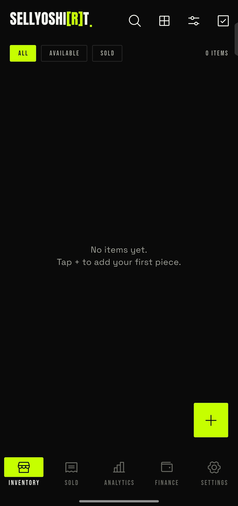
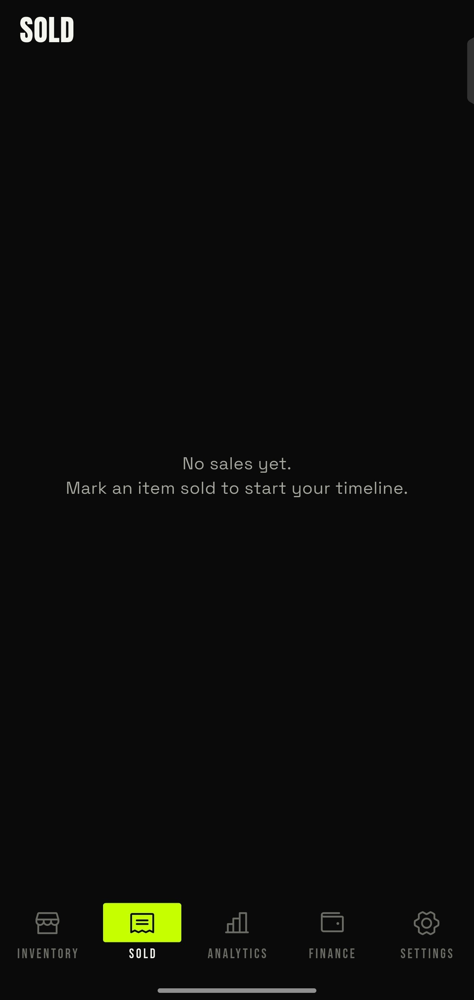
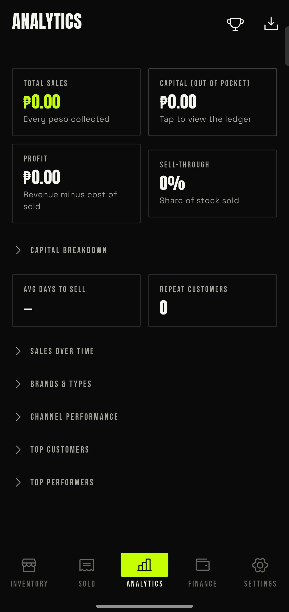
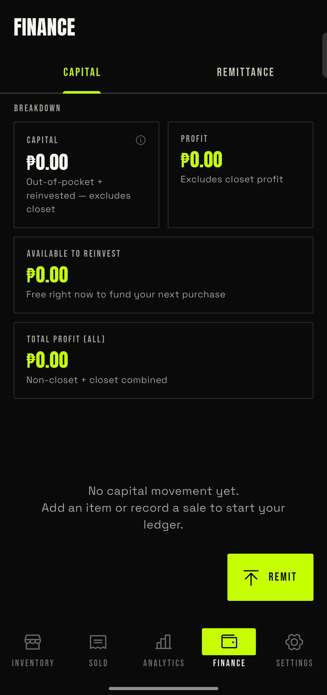
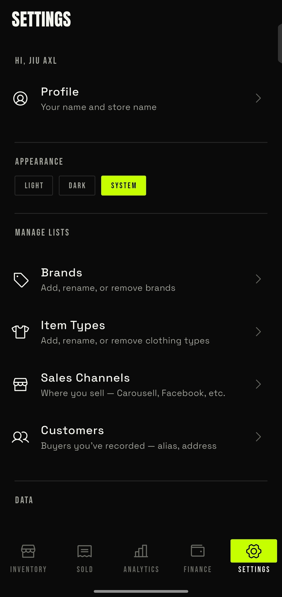

# Navigation Items Walkthrough

A quick reference for every navigation item in the application. This will guide you on what to expect on every page.

## Inventory

Inventory is the homepage of the application. This page is where you manage your clothes, and where you sell them. This includes filtering, searching, and also adding new stock. Check out the [Inventory Overview](../inventory/01-inventory-overview.md) to know more.

## Sold

This page will show you the timeline of your sold items per transaction. You can learn more on the [Sold Page Walkthrough](../sold/01-sold-walkthrough.md).

## Analytics

This is where you see how your shop's actually performing — sales trends, stats, and other numbers to nerd out on. Check out the [Analytics Overview](../analytics/01-analytics-overview.md) to know more.

## Finance

This page tracks the money side of things — capital, remittances, and the rest of your shop's finances. Check out the [Finance Overview](../finance/01-finance-overview.md) to know more.

## Settings

This is where you tweak your store profile and other app-wide preferences. Check out the [Settings Walkthrough](../settings/01-settings-walkthrough.md) to know more.