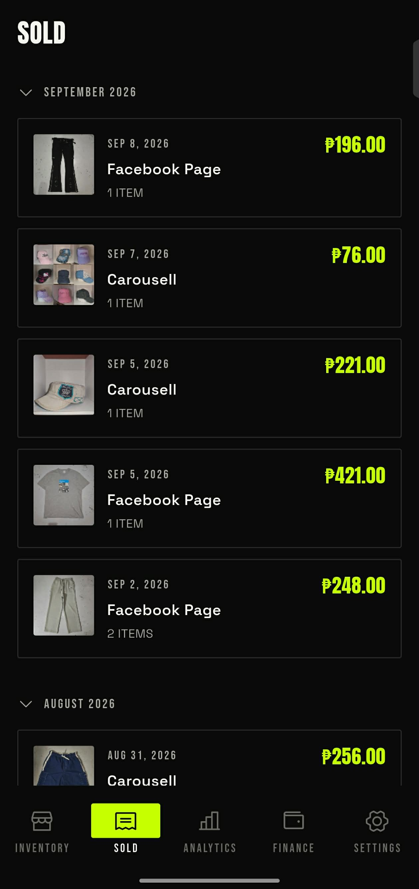
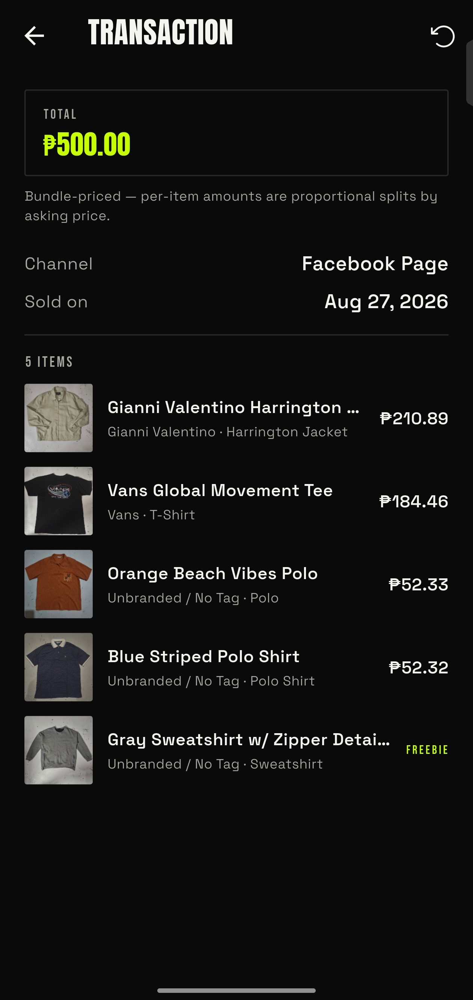
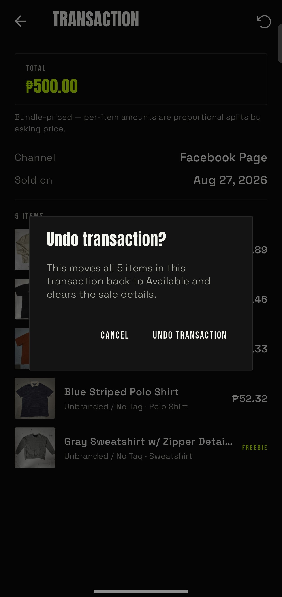

# Sold Page Walkthrough
Sold page is pretty straightforward so I will make this a one-page guide only. Plus I'm pretty tired of explaining this stuff. I already made the application very user friendly, so me making these docs is just second-guessing my audience, right. Lol, you cannot underestimate someone's stupidity I guess.

## Sold Page Anatomy

### Per Month Section
This is separated into per-month sections. This is collapsible but expanded by default. You can see the timeline of each transaction made.

### Transaction Card
Every sold item is part of a transaction. A transaction is the done deal made by a seller and a customer. A transaction can consist of 1 or more sold items, that's why it's encapsulated by a transaction.

The **Transaction Card** consists of:

- **Thumbnail**
- **Transaction sold date**
- **Total amount sold**
- **Channel**
- **How many items were sold**

## Transaction Details
### Expanded Info

This just shows something similar to the Transaction Card, but with expanded information. It also shows whether the transaction was a bundled transaction or per piece. If you didn't know the difference, please read the [Selling Items](../inventory/04-selling-items.md) page first. Don't make a fool out of yourself.

### Action Button

The **Action Button** is just the **Back** button and the **Undo** button. This is the same **Undo** button the item details page refers to. This undoes not just one sold item, but the whole transaction itself. The app doesn't have an edit transaction feature, but it does have an undo button. If you think the app should have an edit button, just [state your concern here](/contact) lol.

